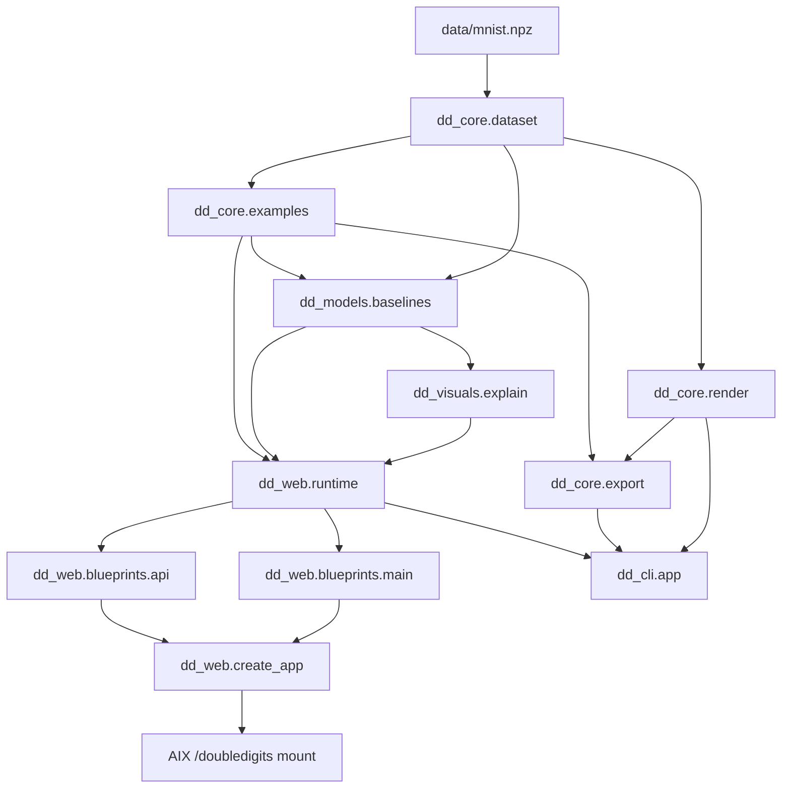
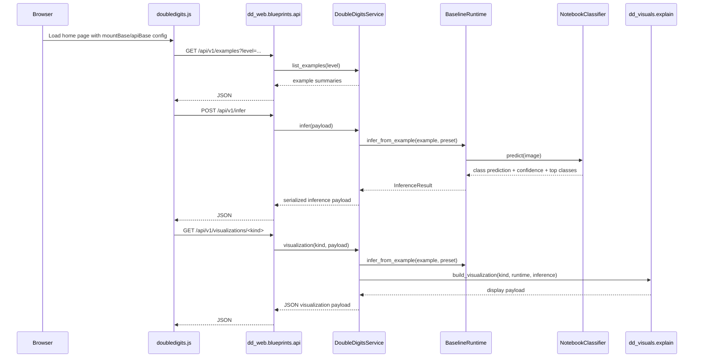

# Architecture

## End-To-End Shape

The live data and control flow is:

`data/mnist.npz` -> `dd_core.dataset` -> `dd_core.examples` and `dd_core.render` -> `dd_models.baselines` -> `dd_visuals.explain` and `dd_core.export` -> `dd_web` and `dd_cli` -> optional AIX mount.

This is intentionally a layered design:

- `dd_core` defines domain primitives and notebook semantics
- `dd_models` adds trainable/runtime behavior on top of those primitives
- `dd_visuals` converts runtime outputs into display-oriented payloads
- `dd_web` and `dd_cli` expose the system without re-encoding model logic

## Package Dependency Diagram

## Request Flow Diagram

## Data Pipeline

### Source Data

- Preferred source: bundled `data/mnist.npz`
- Fallback source: `keras.datasets.mnist.load_data()`
- Output shapes from `dd_core.dataset`:
  - train/test digit images as unsigned `28x28` arrays
  - train/test digit labels as integer arrays
  - digit-index lookup tables and class means

### Example Construction

`ExampleCatalog` is the canonical builder for all three levels.

- curated examples come from `dd_core.constants.CURATED_EXAMPLES`
- structured examples come from request/CLI payloads
- generated examples are deterministic and used for export flows

Rendering responsibilities split deliberately:

- `dd_core.examples`
  - chooses semantics and metadata
- `dd_core.render`
  - composes digit tiles, overlays operators, and serializes image payloads

## Model Pipeline

`dd_models.baselines` is the core runtime layer.

- `PRESETS` registers notebook-derived model families
- `NotebookClassifier` owns one preset, its artifact files, and its explainability helpers
- `BaselineRuntime` selects the correct preset for a level and normalizes inference results into a common contract

Important invariants:

- artifact filenames come from `ModelPreset.artifact_name`
- input mode controls whether the model expects plain image grids or channel-last tensors
- `double` and `arithmetic` return `0..99` class ids
- arithmetic input scenes carry left/right/operator metadata, while the predicted class encodes only the result value

## Visualization And Export Pipeline

`dd_visuals.explain.build_visualization` translates `InferenceResult` plus runtime/model helpers into display payloads:

- `feature_maps`
  - learned activation views with `viridis`
- `prototype`
  - class means plus first-layer weight maps with `binary_r` and `bone`
- `comparison`
  - generated scene, source evidence, operator context, and optional predicted result image

`dd_core.export` then writes two filesystem-oriented artifact families:

- generated example bundles
  - `images/`, `manifest.csv`, `dataset.npz`
- visualization exports
  - PNG files derived from visualization data URIs

## Web And CLI Composition

### Web

- `dd_web.create_app`
  - builds the Flask app and registers blueprints
- `DoubleDigitsService`
  - exposes list, infer, visualize, and health operations
- `doubledigits.js`
  - fetches examples, optional preset metadata, inference, and all three visualization families
- template globals
  - inject `mountBase` and `apiBase` so the frontend never hard-codes root-relative paths

### CLI

`dd_cli.app` uses the same underlying dataset, example, export, visualization, and runtime layers.

CLI-only responsibilities are:

- training named presets
- writing generated batches to disk
- writing visualization files to disk

## AIX Boundary

The sibling AIX repo mounts DD through `aix_web/labs/doubledigits_adapter.py`.

That adapter:

- locates the repo through `AIX_DOUBLEDIGITS_REPO` or the default sibling path
- imports `dd_web`
- calls `create_app`
- passes through selected `DOUBLEDIGITS_*` config

Maintainers should preserve these assumptions:

- importing `dd_web.create_app` must remain side-effect-safe
- mounted URLs must work through `SCRIPT_NAME` / `APP_BASE_PATH`
- the frontend must derive API URLs from server-rendered config
- browser inference in cloud must not depend on live training or dataset downloads
